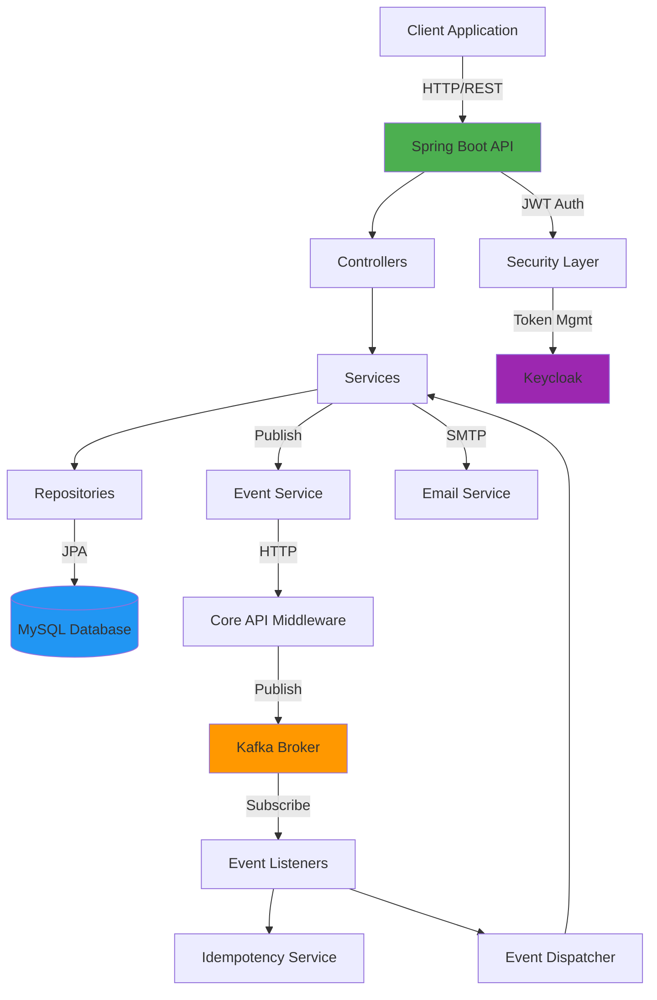

## Overview

The Ecommerce Backend API is built using Spring Boot with a layered architecture that separates concerns across Controllers, Services, and Repositories. The system integrates with external services like Kafka for event-driven communication, Keycloak for authentication, and MySQL for data persistence.

## Architectural Layers

### Controller → Service → Repository Pattern

The application follows a traditional three-tier architecture:

<CardGroup cols={3}>
  <Card title="Controllers" icon="browser">
    Handle HTTP requests, validation, and response formatting
  </Card>
  <Card title="Services" icon="gears">
    Implement business logic and orchestrate data operations
  </Card>
  <Card title="Repositories" icon="database">
    Manage data persistence using Spring Data JPA
  </Card>
</CardGroup>

#### Example Flow

Here's how a product review creation flows through the layers:

**1. Controller Layer** (`ProductController.java:145`)

```java
@PostMapping("/code/{productCode}/review")
public ReviewResponse addReview(
    @PathVariable Integer productCode, 
    @RequestBody ReviewRequest reviewRequest
) {
    // Validate product exists
    Product product = productRepository.findByProductCode(productCode);
    if (product == null) {
        throw new ResponseStatusException(
            HttpStatus.NOT_FOUND, 
            "Producto no encontrado"
        );
    }
    
    // Create review
    Review review = new Review();
    review.setProduct(product);
    review.setCalification(reviewRequest.getCalification());
    reviewRepository.save(review);
    
    // Emit event
    ecommerceEventService.emitReviewCreated(
        product.getProductCode(), 
        reviewRequest.getDescription(), 
        promedio
    );
}
```

**2. Service Layer** (`ECommerceEventService.java:114`)

```java
public void emitReviewCreated(
    Integer productCode, 
    String message, 
    Float rateUpdated
) {
    Map<String, Object> payload = new HashMap<>();
    payload.put("productCode", productCode);
    payload.put("message", message);
    payload.put("rateUpdated", rateUpdated);
    
    // Persist locally first
    persistLocalEvent("POST: Review creada", payload);
    
    // Send to Core API
    CoreEvent event = new CoreEvent(
        "POST: Review creada", 
        payload, 
        originModuleName
    );
    coreApiClient.sendEvent(event);
}
```

**3. Repository Layer** (`ProductRepository.java`)

```java
@Repository
public interface ProductRepository extends JpaRepository<Product, Integer> {
    Product findByProductCode(Integer productCode);
}
```

<Note>
Repositories extend `JpaRepository` to provide built-in CRUD operations plus custom query methods.
</Note>

## Package Structure

The codebase is organized into focused packages:

```bash
ar.edu.uade.ecommerce/
├── Controllers/          # REST endpoints
│   ├── AuthController.java
│   ├── ProductController.java
│   ├── PurchaseController.java
│   └── CartController.java
├── Service/             # Business logic
│   ├── AuthService.java
│   ├── ProductService.java
│   └── PurchaseService.java
├── Repository/          # Data access
│   ├── ProductRepository.java
│   ├── UserRepository.java
│   └── ConsumedEventLogRepository.java
├── Entity/              # JPA entities and DTOs
│   ├── Product.java
│   ├── User.java
│   └── DTO/
├── Security/            # Authentication & authorization
│   ├── JwtUtil.java
│   ├── JwtAuthenticationFilter.java
│   └── SecurityConfig.java
├── messaging/           # Event publishing
│   ├── ECommerceEventService.java
│   ├── CoreApiClient.java
│   └── BackendTokenManager.java
└── ventas/              # Event consumption
    ├── InventarioEventsListener.java
    ├── EventIdempotencyService.java
    └── VentasInventoryRetryScheduler.java
```

## Database Schema Approach

The application uses JPA/Hibernate with MySQL for data persistence.

### Entity Relationships

**Product Entity** (`Product.java:13`)

```java
@Entity
public class Product {
    @Id
    @GeneratedValue(strategy = GenerationType.IDENTITY)
    private Integer id;
    
    @ManyToOne
    @JoinColumn(name = "brand_id")
    @JsonBackReference("brand-product")
    private Brand brand;
    
    @ManyToMany
    @JoinTable(
        name = "product_category",
        joinColumns = @JoinColumn(name = "product_id"),
        inverseJoinColumns = @JoinColumn(name = "category_id")
    )
    private Set<Category> categories;
    
    @Column
    private Integer productCode;
    
    @Column
    private Float price;
    
    @Column
    private Integer stock;
}
```

<Info>
The system uses `productCode` as a business identifier for cross-service communication, while `id` is the internal primary key.
</Info>

### Schema Management

From `application.properties:23`:

```properties
# JPA/Hibernate auto-update schema
spring.jpa.hibernate.ddl-auto=update
spring.jpa.show-sql=false

# Disable SQL scripts on startup
spring.jpa.defer-datasource-initialization=false
spring.sql.init.mode=never
```

<Warning>
The `ddl-auto=update` setting automatically updates the database schema based on entity changes. Use migrations for production deployments.
</Warning>

## Integration Points

### 1. Kafka Event Streaming

The system both produces and consumes events via Kafka for asynchronous communication with other microservices.

**Configuration** (`application.properties:71`)

```properties
spring.kafka.bootstrap-servers=${KAFKA_BOOTSTRAP:localhost:9092}
spring.kafka.consumer.group-id=ventas-ms

# Topics
ventas.kafka.topic=ventas
inventario.kafka.topic=inventario

# Security
spring.kafka.consumer.properties.security.protocol=SASL_PLAINTEXT
spring.kafka.consumer.properties.sasl.mechanism=SCRAM-SHA-512
```

### 2. Keycloak Authentication

Keycloak provides OAuth2/OIDC token management for backend service-to-service authentication.

**Configuration** (`application.properties:55`)

```properties
keycloak.token.url=${KEYCLOAK_TOKEN_URL}
keycloak.client-id=ventas-app
keycloak.client-secret=${KEYCLOAK_CLIENT_SECRET}
```

<Tip>
The application uses Keycloak for backend token management while implementing JWT-based user authentication internally.
</Tip>

### 3. Email Service

SMTP integration for sending verification emails and notifications.

**Configuration** (`application.properties:32`)

```properties
spring.mail.host=smtp.gmail.com
spring.mail.port=587
spring.mail.username=${SPRING_MAIL_USERNAME}
spring.mail.password=${SPRING_MAIL_PASSWORD}
spring.mail.properties.mail.smtp.starttls.enable=true
```

### 4. Core Communication Middleware

Events are routed through a central communication API that publishes to Kafka.

**Configuration** (`application.properties:43`)

```properties
# Core API routes and publishes to Kafka
core.api.url=${CORE_API_URL:http://localhost:8086}

# Kafka middleware for ACK responses
communication.intermediary.url=${KAFKA_MIDDLEWARE_URL:http://localhost:8090}
```

## Component Diagram



## Next Steps

<CardGroup cols={2}>
  <Card title="Authentication" icon="lock" href="/concepts/authentication">
    Learn about JWT tokens and Keycloak integration
  </Card>
  <Card title="Event-Driven" icon="bolt" href="/concepts/event-driven">
    Understand Kafka event patterns and idempotency
  </Card>
</CardGroup>