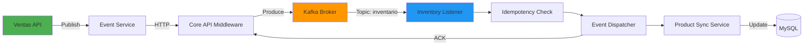
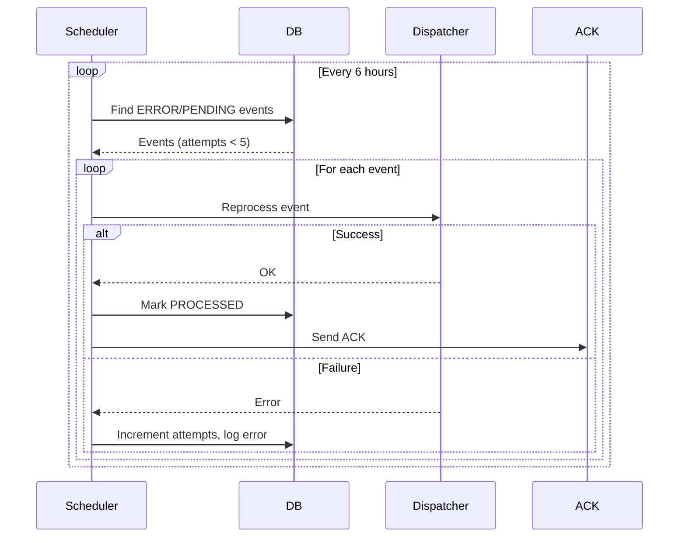

## Overview

The Ecommerce Backend API uses Apache Kafka for asynchronous, event-driven communication between microservices. The system both **produces** events (purchases, reviews, favorites) and **consumes** events (inventory updates) to maintain eventual consistency.

## Kafka Architecture

### Event Flow



### Kafka Configuration

**Connection Settings** (`application.properties:71`)

```properties
# Kafka bootstrap servers
spring.kafka.bootstrap-servers=${KAFKA_BOOTSTRAP:localhost:9092}
spring.kafka.consumer.group-id=ventas-ms
spring.kafka.consumer.auto-offset-reset=earliest

# JSON deserialization
spring.kafka.consumer.value-deserializer=org.springframework.kafka.support.serializer.JsonDeserializer
spring.kafka.consumer.properties.spring.json.use.type.headers=false
spring.kafka.consumer.properties.spring.json.value.default.type=ar.edu.uade.ecommerce.ventas.EventMessage
spring.kafka.consumer.properties.spring.json.trusted.packages=*

# SASL authentication
spring.kafka.consumer.properties.security.protocol=SASL_PLAINTEXT
spring.kafka.consumer.properties.sasl.mechanism=SCRAM-SHA-512
spring.kafka.consumer.properties.sasl.jaas.config=org.apache.kafka.common.security.scram.ScramLoginModule required username="${KAFKA_USERNAME}" password="${KAFKA_PASSWORD}";
```

<Warning>
Always use SASL authentication in production environments. Never commit Kafka credentials to source control.
</Warning>

### Topic Configuration

**Ventas Topic** - Outbound events from this service

```properties
ventas.kafka.enabled=true
ventas.kafka.topic=ventas
ventas.kafka.concurrency=3
ventas.kafka.listen-ventas=false  # Don't consume own events
```

**Inventario Topic** - Inbound inventory updates

```properties
inventario.kafka.topic=inventario
inventario.kafka.concurrency=1
inventario.kafka.listen-inventario=true

# Don't fail if topic doesn't exist yet
spring.kafka.listener.missing-topics-fatal=false
```

## Event Producers

The service publishes events through the `ECommerceEventService`.

### Event Publishing Pattern

**Publishing Events** (`ECommerceEventService.java:68`)

```java
@Service
public class ECommerceEventService {
    private final CoreApiClient coreApiClient;
    private final EventRepository eventRepository;
    private final ObjectMapper objectMapper;
    
    @Value("${messaging.origin-module:${keycloak.client-id:Ecommerce}}")
    private String originModuleName;
    
    public void emitRawEvent(String type, Object payload) {
        // 1. Ensure backend token is available
        ensureBackendTokenAvailable(type);
        
        // 2. Persist locally first (audit trail)
        persistLocalEvent(type, payload);
        
        // 3. Send to Core API which publishes to Kafka
        CoreEvent event = new CoreEvent(
            type, 
            payload, 
            originModuleName
        );
        logger.info(
            "Emitiendo evento genérico: {} (origin={}) payloadType={}",
            type, originModuleName, 
            payload != null ? payload.getClass().getSimpleName() : "null"
        );
        coreApiClient.sendEvent(event);
    }
    
    private void persistLocalEvent(String type, Object payload) {
        try {
            String payloadJson = payload instanceof String s 
                ? s 
                : objectMapper.writeValueAsString(payload);
            
            Event e = new Event(type, payloadJson);
            eventRepository.save(e);
        } catch (Exception ex) {
            logger.warn(
                "No se pudo persistir localmente el evento '{}': {}",
                type, ex.getMessage()
            );
        }
    }
}
```

<Info>
Events are persisted locally before publishing to provide an audit trail and enable potential replay.
</Info>

### Purchase Events

**Purchase Lifecycle Events** (`ECommerceEventService.java:77`)

```java
public void emitPurchasePending(
    Integer purchaseId, 
    Map<String, Object> user, 
    Map<String, Object> cart
) {
    emitPurchaseEvent(
        "POST: Compra pendiente", 
        purchaseId, 
        user, 
        cart, 
        "PENDING"
    );
}

public void emitPurchaseConfirmed(
    Integer purchaseId,
    Map<String, Object> user,
    Map<String, Object> cart
) {
    emitPurchaseEvent(
        "POST: Compra confirmada",
        purchaseId,
        user,
        cart,
        "CONFIRMED"
    );
}

public void emitPurchaseCancelled(
    Integer purchaseId,
    Map<String, Object> user,
    Map<String, Object> cart
) {
    emitPurchaseEvent(
        "DELETE: Compra cancelada",
        purchaseId,
        user,
        cart,
        "CANCELLED"
    );
}

private void emitPurchaseEvent(
    String type,
    Integer purchaseId,
    Map<String, Object> user,
    Map<String, Object> cart,
    String status
) {
    Map<String, Object> payload = new HashMap<>();
    payload.put("purchaseId", purchaseId);
    payload.put("user", user);
    payload.put("cart", sanitizeCartItems(cart));
    payload.put("status", status);
    
    ensureBackendTokenAvailable(type);
    persistLocalEvent(type, payload);
    
    CoreEvent event = new CoreEvent(type, payload, originModuleName);
    coreApiClient.sendEvent(event);
}
```

**Example Purchase Event Payload**

```json
{
  "eventId": "550e8400-e29b-41d4-a716-446655440000",
  "eventType": "POST: Compra confirmada",
  "originModule": "ventas-app",
  "timestamp": "2026-03-13T10:30:00Z",
  "payload": {
    "purchaseId": 12345,
    "status": "CONFIRMED",
    "user": {
      "id": 789,
      "email": "customer@example.com"
    },
    "cart": {
      "items": [
        {
          "productCode": 1001,
          "quantity": 2,
          "price": 49.99
        }
      ]
    }
  }
}
```

### Review and Favorite Events

**Review Creation** (`ECommerceEventService.java:114`)

```java
public void emitReviewCreated(
    Integer productCode,
    String message,
    Float rateUpdated
) {
    Map<String, Object> payload = new HashMap<>();
    payload.put("productCode", productCode);
    payload.put("message", message);
    payload.put("rateUpdated", rateUpdated);
    
    CoreEvent event = new CoreEvent(
        "POST: Review creada",
        payload,
        originModuleName
    );
    coreApiClient.sendEvent(event);
}
```

**Favorite Management** (`ECommerceEventService.java:129`)

```java
public void emitAddFavorite(
    String productCode,
    Long id,
    String nombre
) {
    Map<String, Object> payload = new HashMap<>();
    payload.put("productCode", productCode);
    payload.put("nombre", nombre);
    
    CoreEvent event = new CoreEvent(
        "POST: Producto agregado a favoritos",
        payload,
        originModuleName
    );
    coreApiClient.sendEvent(event);
}

public void emitRemoveFavorite(
    String productCode,
    Long id,
    String nombre
) {
    Map<String, Object> payload = new HashMap<>();
    payload.put("productCode", productCode);
    payload.put("nombre", nombre);
    
    CoreEvent event = new CoreEvent(
        "DELETE: Producto quitado de favoritos",
        payload,
        originModuleName
    );
    coreApiClient.sendEvent(event);
}
```

## Event Consumers

The service consumes inventory update events from the `inventario` topic.

### Event Message Structure

**EventMessage Model** (`EventMessage.java:11`)

```java
public class EventMessage {
    @JsonProperty("eventId")
    private String eventId;
    
    @JsonProperty("eventType")
    private String eventType;
    
    @JsonProperty("payload")
    private Object payload;
    
    @JsonProperty("originModule")
    private String originModule;
    
    @JsonProperty("timestamp")
    private Object timestamp;  // ISO-8601 string or epoch
    
    @JsonIgnore
    public OffsetDateTime getTimestampAsOffsetDateTime() {
        if (timestamp == null) return OffsetDateTime.now();
        
        // Handle epoch seconds (number)
        if (timestamp instanceof Number num) {
            double seconds = num.doubleValue();
            long secs = (long) seconds;
            long nanos = (long) Math.round(
                (seconds - secs) * 1_000_000_000L
            );
            return OffsetDateTime.ofInstant(
                Instant.ofEpochSecond(secs, nanos),
                ZoneId.systemDefault()
            );
        }
        
        // Handle ISO-8601 string
        if (timestamp instanceof String s) {
            try {
                return OffsetDateTime.parse(s);
            } catch (DateTimeParseException e) {
                return OffsetDateTime.now();
            }
        }
        
        return OffsetDateTime.now();
    }
}
```

### Inventory Event Listener

**Kafka Listener** (`InventarioEventsListener.java:45`)

```java
@Component
@ConditionalOnProperty(
    prefix = "inventario.kafka",
    name = "listen-inventario",
    havingValue = "true",
    matchIfMissing = true
)
public class InventarioEventsListener {
    private final EventIdempotencyService idempotencyService;
    private final VentasInventoryEventDispatcher dispatcher;
    private final ConsumedEventLogRepository eventLogRepo;
    private final CoreAckClient ackClient;
    
    @KafkaListener(
        topics = "${inventario.kafka.topic:inventario}",
        concurrency = "${inventario.kafka.concurrency:1}",
        groupId = "${inventario.kafka.group-id:inventario-ms}"
    )
    public void onMessage(
        @Payload EventMessage msg,
        @Header(name = KafkaHeaders.RECEIVED_TOPIC, required = false) 
            String topic,
        @Header(name = KafkaHeaders.RECEIVED_PARTITION, required = false) 
            Integer partition,
        @Header(name = KafkaHeaders.OFFSET, required = false) 
            Long offset
    ) {
        if (msg == null) {
            log.warn(
                "[Inventario->Ventas][Kafka] Mensaje nulo recibido. " +
                "topic={} partition={} offset={}",
                topic, partition, offset
            );
            return;
        }
        
        String eventId = msg.getEventId();
        String eventType = msg.getEventType();
        
        log.info(
            "[Inventario->Ventas][Kafka] Recibido eventId={} " +
            "type='{}' origin={} ts={} topic={} partition={} offset={}",
            eventId, eventType, msg.getOriginModule(), 
            msg.getTimestamp(), topic, partition, offset
        );
        
        // 1. Save/update event log
        ConsumedEventLog logRow = eventLogRepo
            .findByEventId(eventId)
            .orElseGet(ConsumedEventLog::new);
        
        logRow.setEventId(eventId);
        logRow.setEventType(eventType);
        logRow.setOriginModule(msg.getOriginModule());
        logRow.setTopic(topic);
        logRow.setPartitionId(partition);
        logRow.setOffsetValue(offset);
        logRow.setStatus(ConsumedEventStatus.PENDING);
        logRow.setUpdatedAt(OffsetDateTime.now());
        logRow = eventLogRepo.save(logRow);
        
        // 2. Check idempotency
        if (idempotencyService.alreadyProcessed(eventId) ||
            logRow.getStatus() == ConsumedEventStatus.PROCESSED) {
            log.info(
                "[Inventario->Ventas][Kafka] Evento ya procesado. " +
                "eventId={} eventType={}",
                eventId, eventType
            );
            
            // Try to send ACK if not sent yet
            if (Boolean.FALSE.equals(logRow.getAckSent())) {
                boolean ackOk = ackClient.sendAck(eventId, "ventas");
                logRow.setAckSent(ackOk);
                eventLogRepo.save(logRow);
            }
            return;
        }
        
        // 3. Process the event
        try {
            dispatcher.process(msg);
            idempotencyService.markProcessed(eventId);
            
            logRow.setStatus(ConsumedEventStatus.PROCESSED);
            logRow.setAttempts(
                logRow.getAttempts() == null ? 1 : logRow.getAttempts() + 1
            );
            logRow.setLastError(null);
            
            // 4. Send ACK to middleware
            boolean ackOk = ackClient.sendAck(eventId, "ventas");
            logRow.setAckSent(ackOk);
            logRow.setAckLastAt(OffsetDateTime.now());
            
            eventLogRepo.save(logRow);
            
            log.info(
                "[Inventario->Ventas][Kafka] Procesado OK " +
                "eventId={} type={} ackSent={}",
                eventId, eventType, ackOk
            );
        } catch (Exception ex) {
            log.error(
                "[Inventario->Ventas][Kafka] Error procesando " +
                "eventId={} type={} - {}",
                eventId, eventType, ex.getMessage(), ex
            );
            
            logRow.setStatus(ConsumedEventStatus.ERROR);
            logRow.setAttempts(
                logRow.getAttempts() == null ? 1 : logRow.getAttempts() + 1
            );
            logRow.setLastError(ex.toString());
            eventLogRepo.save(logRow);
            
            throw ex; // Allow Kafka retry/backoff
        }
    }
}
```

<Note>
The listener logs every event to the `consumed_event_log` table for tracking, debugging, and retry purposes.
</Note>

## Event Idempotency

Idempotency ensures events are processed exactly once, even if received multiple times.

### Idempotency Service

**In-Memory Deduplication** (`EventIdempotencyService.java:14`)

```java
@Service
public class EventIdempotencyService {
    private static final Logger log = LoggerFactory.getLogger(
        EventIdempotencyService.class
    );
    
    private final Map<String, Instant> processed = new ConcurrentHashMap<>();
    private final Duration ttl = Duration.ofHours(24);
    private final int maxSize = 10_000;
    
    public boolean alreadyProcessed(String eventId) {
        if (eventId == null || eventId.isBlank()) return false;
        
        purgeIfNeeded();
        
        Instant ts = processed.get(eventId);
        if (ts == null) return false;
        
        // Check if expired
        boolean expired = ts.isBefore(Instant.now().minus(ttl));
        if (expired) {
            processed.remove(eventId);
            return false;
        }
        
        return true;
    }
    
    public void markProcessed(String eventId) {
        if (eventId == null || eventId.isBlank()) return;
        
        purgeIfNeeded();
        processed.put(eventId, Instant.now());
    }
    
    private void purgeIfNeeded() {
        if (processed.size() <= maxSize) return;
        
        // Remove expired entries first
        Instant threshold = Instant.now().minus(ttl);
        processed.entrySet().removeIf(
            e -> e.getValue().isBefore(threshold)
        );
        
        // If still over capacity, trim 10%
        int size = processed.size();
        if (size > maxSize) {
            int toRemove = (int) (size * 0.1);
            processed.keySet()
                .stream()
                .limit(toRemove)
                .forEach(processed::remove);
            log.warn(
                "[Idempotency] Recorte de mapa de eventIds: {} removidos",
                toRemove
            );
        }
    }
}
```

<Warning>
The in-memory idempotency cache is lost on application restart. The database `consumed_event_log` table provides persistent idempotency.
</Warning>

### Database-Backed Idempotency

Events are tracked in the `consumed_event_log` table:

| Column | Type | Purpose |
|--------|------|----------|
| `event_id` | VARCHAR(255) | Unique event identifier |
| `event_type` | VARCHAR(255) | Event type/action |
| `status` | ENUM | PENDING, PROCESSED, ERROR |
| `attempts` | INT | Number of processing attempts |
| `last_error` | TEXT | Last error message if failed |
| `ack_sent` | BOOLEAN | Whether ACK was sent to middleware |
| `created_at` | TIMESTAMP | First seen timestamp |
| `updated_at` | TIMESTAMP | Last update timestamp |

## Retry Mechanisms

Failed events are automatically retried using a scheduled job.

### Retry Scheduler

**Configuration** (`application.properties:129`)

```properties
# Retry scheduler settings
ventas.retry.enabled=true
ventas.retry.cron=0 0 */6 * * *  # Every 6 hours
ventas.retry.maxAttempts=5
ventas.retry.cooldown.minutes=30
ventas.retry.batchSize=100
```

**Retry Implementation** (`VentasInventoryRetryScheduler.java:50`)

```java
@Component
@ConditionalOnProperty(
    prefix = "ventas.retry",
    name = "enabled",
    havingValue = "true",
    matchIfMissing = true
)
public class VentasInventoryRetryScheduler {
    private final ConsumedEventLogRepository repo;
    private final VentasInventoryEventDispatcher dispatcher;
    private final CoreAckClient ackClient;
    
    @Value("${ventas.retry.maxAttempts:5}")
    private int maxAttempts;
    
    @Value("${ventas.retry.cooldown.minutes:30}")
    private int cooldownMinutes;
    
    @Value("${ventas.retry.batchSize:100}")
    private int batchSize;
    
    @Scheduled(cron = "${ventas.retry.cron:0 0 */6 * * *}")
    public void runBatch() {
        OffsetDateTime threshold = OffsetDateTime.now()
            .minusMinutes(cooldownMinutes);
        
        // Find failed events ready for retry
        List<ConsumedEventLog> pending = repo
            .findByStatusInAndAttemptsLessThanAndUpdatedAtBeforeOrderByUpdatedAtAsc(
                List.of(
                    ConsumedEventStatus.ERROR,
                    ConsumedEventStatus.PENDING
                ),
                maxAttempts,
                threshold,
                PageRequest.of(0, batchSize)
            );
        
        if (pending.isEmpty()) {
            log.debug(
                "[RetryScheduler] No hay eventos pendientes para reprocesar."
            );
            return;
        }
        
        log.info(
            "[RetryScheduler] Reintentando {} eventos " +
            "(cooldown={}m, maxAttempts={})",
            pending.size(), cooldownMinutes, maxAttempts
        );
        
        for (ConsumedEventLog e : pending) {
            try {
                EventMessage msg = toEventMessage(e);
                dispatcher.process(msg);
                
                e.setStatus(ConsumedEventStatus.PROCESSED);
                e.setLastError(null);
                e.setAttempts(
                    e.getAttempts() == null ? 1 : e.getAttempts() + 1
                );
                
                // Try to send ACK
                boolean ackOk = ackClient.sendAck(e.getEventId(), "ventas");
                e.setAckSent(ackOk);
                e.setAckLastAt(OffsetDateTime.now());
            } catch (Exception ex) {
                e.setStatus(ConsumedEventStatus.ERROR);
                e.setLastError(ex.toString());
                e.setAttempts(
                    e.getAttempts() == null ? 1 : e.getAttempts() + 1
                );
                log.warn(
                    "[RetryScheduler] Error reprocesando " +
                    "eventId={} type={} - {}",
                    e.getEventId(), e.getEventType(), ex.getMessage()
                );
            } finally {
                e.setUpdatedAt(OffsetDateTime.now());
                repo.save(e);
            }
        }
    }
}
```

<Tip>
The retry mechanism implements exponential backoff by requiring a cooldown period between attempts.
</Tip>

### Retry Flow Diagram



## Event Types and Payloads

### Outbound Events (Produced)

| Event Type | Trigger | Payload |
|-----------|---------|----------|
| `POST: Compra pendiente` | Purchase created | `{ purchaseId, user, cart, status: "PENDING" }` |
| `POST: Compra confirmada` | Purchase confirmed | `{ purchaseId, user, cart, status: "CONFIRMED" }` |
| `DELETE: Compra cancelada` | Purchase cancelled | `{ purchaseId, user, cart, status: "CANCELLED" }` |
| `POST: Review creada` | Product reviewed | `{ productCode, message, rateUpdated }` |
| `POST: Producto agregado a favoritos` | Product favorited | `{ productCode, nombre }` |
| `DELETE: Producto quitado de favoritos` | Product unfavorited | `{ productCode, nombre }` |

### Inbound Events (Consumed)

The service consumes inventory-related events from the `inventario` topic to update product stock and availability.

**Example Inventory Event**

```json
{
  "eventId": "inv-550e8400-e29b-41d4-a716-446655440000",
  "eventType": "PATCH: Stock actualizado",
  "originModule": "inventario-app",
  "timestamp": 1710327000.123,
  "payload": {
    "productCode": 1001,
    "stock": 150,
    "active": true
  }
}
```

## Monitoring and Observability

### Consumer Metrics

The `VentasConsumerMonitorService` tracks consumption metrics:

- Events processed (by type)
- Duplicate events detected
- Processing errors (by type)
- Last processing timestamp

### Event Log Queries

**Find Failed Events**

```sql
SELECT event_id, event_type, attempts, last_error, updated_at
FROM consumed_event_log
WHERE status = 'ERROR'
  AND attempts < 5
ORDER BY updated_at DESC;
```

**Check Event Processing Status**

```sql
SELECT 
  status,
  COUNT(*) as count,
  AVG(attempts) as avg_attempts
FROM consumed_event_log
GROUP BY status;
```

<Info>
Enable detailed Kafka logging with `logging.level.ar.edu.uade.ecommerce.ventas=DEBUG` for troubleshooting.
</Info>

## Best Practices

<CardGroup cols={2}>
  <Card title="Idempotent Handlers" icon="repeat">
    Always design event handlers to be idempotent - safe to process multiple times
  </Card>
  <Card title="Event Versioning" icon="code-branch">
    Include version information in event types or payload for schema evolution
  </Card>
  <Card title="Local Persistence" icon="database">
    Persist events locally before publishing for audit and replay capability
  </Card>
  <Card title="Monitoring" icon="chart-line">
    Monitor consumer lag, error rates, and retry queue depth
  </Card>
</CardGroup>

## Related Documentation

<CardGroup cols={2}>
  <Card title="Architecture" icon="sitemap" href="/concepts/architecture">
    Understand how events fit into the overall architecture
  </Card>
  <Card title="Purchase API" icon="shopping-cart" href="/api/orders/create-order">
    API reference for purchase endpoints that emit events
  </Card>
</CardGroup>