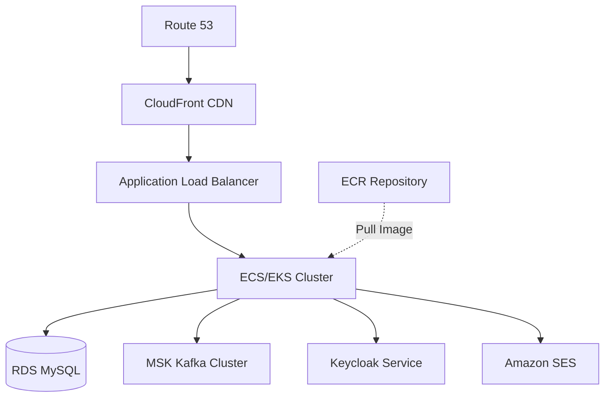

## Overview

This guide provides best practices and architecture recommendations for deploying the Ecommerce Backend API on AWS using managed services including ECS/EKS, RDS, MSK, and ECR.

<Note>
  This is a reference architecture guide. The source code does not include AWS-specific deployment configurations, so you'll need to adapt these recommendations to your specific requirements.
</Note>

## Architecture Overview



## AWS Services

### Amazon ECR (Container Registry)

<Steps>
  <Step title="Create ECR Repository">
    ```bash
    aws ecr create-repository \
      --repository-name ecommerce-backend \
      --region us-east-1
    ```
  </Step>
  
  <Step title="Authenticate Docker">
    ```bash
    aws ecr get-login-password --region us-east-1 | \
      docker login --username AWS \
      --password-stdin <account-id>.dkr.ecr.us-east-1.amazonaws.com
    ```
  </Step>
  
  <Step title="Build and Tag Image">
    ```bash
    docker build -t ecommerce-backend:latest .
    docker tag ecommerce-backend:latest \
      <account-id>.dkr.ecr.us-east-1.amazonaws.com/ecommerce-backend:latest
    ```
  </Step>
  
  <Step title="Push to ECR">
    ```bash
    docker push <account-id>.dkr.ecr.us-east-1.amazonaws.com/ecommerce-backend:latest
    ```
  </Step>
</Steps>

### Amazon RDS (MySQL Database)

<Steps>
  <Step title="Create RDS MySQL Instance">
    Use RDS for managed MySQL database:
    
    ```bash
    aws rds create-db-instance \
      --db-instance-identifier ecommerce-db \
      --db-instance-class db.t3.medium \
      --engine mysql \
      --engine-version 8.0.35 \
      --master-username admin \
      --master-user-password <secure-password> \
      --allocated-storage 100 \
      --storage-type gp3 \
      --vpc-security-group-ids sg-xxxxxxxxx \
      --db-subnet-group-name ecommerce-db-subnet \
      --backup-retention-period 7 \
      --preferred-backup-window "03:00-04:00" \
      --preferred-maintenance-window "mon:04:00-mon:05:00" \
      --multi-az \
      --storage-encrypted
    ```
  </Step>
  
  <Step title="Configure Security Group">
    Allow inbound traffic from ECS tasks:
    
    ```bash
    aws ec2 authorize-security-group-ingress \
      --group-id sg-rds-xxxxxxxxx \
      --protocol tcp \
      --port 3306 \
      --source-group sg-ecs-xxxxxxxxx
    ```
  </Step>
  
  <Step title="Set Environment Variables">
    Configure the application to connect to RDS:
    
    ```bash
    SPRING_DATASOURCE_URL=ecommerce-db.xxxxxxxxx.us-east-1.rds.amazonaws.com:3306/ecommerce
    SPRING_DATASOURCE_USERNAME=admin
    SPRING_DATASOURCE_PASSWORD=<secure-password>
    ```
  </Step>
</Steps>

<Tip>
  Enable automated backups and Multi-AZ deployment for production environments. Consider using RDS Proxy for connection pooling with Lambda functions or high-concurrency workloads.
</Tip>

### Amazon MSK (Managed Kafka)

The application uses Kafka with SASL_PLAINTEXT and SCRAM-SHA-512 authentication.

<Steps>
  <Step title="Create MSK Cluster">
    ```bash
    aws kafka create-cluster \
      --cluster-name ecommerce-kafka \
      --broker-node-group-info file://broker-config.json \
      --kafka-version 3.5.1 \
      --number-of-broker-nodes 3 \
      --encryption-info file://encryption-config.json \
      --client-authentication file://sasl-config.json
    ```
    
    **sasl-config.json**:
    ```json
    {
      "Sasl": {
        "Scram": {
          "Enabled": true
        }
      },
      "Unauthenticated": {
        "Enabled": false
      }
    }
    ```
  </Step>
  
  <Step title="Create SCRAM Credentials">
    Store Kafka credentials in AWS Secrets Manager:
    
    ```bash
    aws secretsmanager create-secret \
      --name AmazonMSK_ecommerce_kafka \
      --secret-string '{"username":"kafka_user","password":"secure-password"}'
    
    aws kafka batch-associate-scram-secret \
      --cluster-arn <cluster-arn> \
      --secret-arn-list <secret-arn>
    ```
  </Step>
  
  <Step title="Create Kafka Topics">
    Create required topics:
    
    ```bash
    # Get bootstrap servers
    aws kafka get-bootstrap-brokers --cluster-arn <cluster-arn>
    
    # Create topics
    kafka-topics.sh --create \
      --bootstrap-server <bootstrap-servers> \
      --command-config client.properties \
      --topic ventas \
      --partitions 3 \
      --replication-factor 3
    
    kafka-topics.sh --create \
      --bootstrap-server <bootstrap-servers> \
      --command-config client.properties \
      --topic inventario \
      --partitions 3 \
      --replication-factor 3
    ```
    
    **client.properties**:
    ```properties
    security.protocol=SASL_SSL
    sasl.mechanism=SCRAM-SHA-512
    sasl.jaas.config=org.apache.kafka.common.security.scram.ScramLoginModule required username="kafka_user" password="secure-password";
    ```
  </Step>
  
  <Step title="Configure Application">
    Set Kafka environment variables:
    
    ```bash
    KAFKA_BOOTSTRAP=<bootstrap-servers>:9096
    KAFKA_USERNAME=kafka_user
    KAFKA_PASSWORD=<from-secrets-manager>
    ```
  </Step>
</Steps>

<Warning>
  MSK uses port 9096 for SASL_SSL and 9092 for PLAINTEXT. In production, always use 9096 with SASL_SSL. Update the application's Kafka configuration to use `SASL_SSL` instead of `SASL_PLAINTEXT`.
</Warning>

### Amazon ECS (Elastic Container Service)

<CodeGroup>
```json Task Definition
{
  "family": "ecommerce-backend",
  "networkMode": "awsvpc",
  "requiresCompatibilities": ["FARGATE"],
  "cpu": "1024",
  "memory": "2048",
  "executionRoleArn": "arn:aws:iam::<account-id>:role/ecsTaskExecutionRole",
  "taskRoleArn": "arn:aws:iam::<account-id>:role/ecsTaskRole",
  "containerDefinitions": [
    {
      "name": "ecommerce-backend",
      "image": "<account-id>.dkr.ecr.us-east-1.amazonaws.com/ecommerce-backend:latest",
      "portMappings": [
        {
          "containerPort": 8081,
          "protocol": "tcp"
        }
      ],
      "environment": [
        {"name": "SERVER_PORT", "value": "8081"},
        {"name": "SPRING_DATASOURCE_URL", "value": "ecommerce-db.xxxxxxxxx.us-east-1.rds.amazonaws.com:3306/ecommerce"}
      ],
      "secrets": [
        {"name": "SPRING_DATASOURCE_USERNAME", "valueFrom": "arn:aws:secretsmanager:us-east-1:<account-id>:secret:rds-credentials:username::"},
        {"name": "SPRING_DATASOURCE_PASSWORD", "valueFrom": "arn:aws:secretsmanager:us-east-1:<account-id>:secret:rds-credentials:password::"},
        {"name": "JWT_SECRET", "valueFrom": "arn:aws:secretsmanager:us-east-1:<account-id>:secret:jwt-secret::"},
        {"name": "KEYCLOAK_CLIENT_SECRET", "valueFrom": "arn:aws:secretsmanager:us-east-1:<account-id>:secret:keycloak-secret::"},
        {"name": "KAFKA_USERNAME", "valueFrom": "arn:aws:secretsmanager:us-east-1:<account-id>:secret:AmazonMSK_ecommerce_kafka:username::"},
        {"name": "KAFKA_PASSWORD", "valueFrom": "arn:aws:secretsmanager:us-east-1:<account-id>:secret:AmazonMSK_ecommerce_kafka:password::"}
      ],
      "logConfiguration": {
        "logDriver": "awslogs",
        "options": {
          "awslogs-group": "/ecs/ecommerce-backend",
          "awslogs-region": "us-east-1",
          "awslogs-stream-prefix": "ecs"
        }
      },
      "healthCheck": {
        "command": ["CMD-SHELL", "curl -f http://localhost:8081/api/actuator/health || exit 1"],
        "interval": 30,
        "timeout": 5,
        "retries": 3,
        "startPeriod": 60
      }
    }
  ]
}
```

```bash Create Service
aws ecs create-service \
  --cluster ecommerce-cluster \
  --service-name ecommerce-backend-service \
  --task-definition ecommerce-backend:1 \
  --desired-count 2 \
  --launch-type FARGATE \
  --network-configuration "awsvpcConfiguration={subnets=[subnet-xxxxx,subnet-yyyyy],securityGroups=[sg-xxxxxxxxx],assignPublicIp=DISABLED}" \
  --load-balancers "targetGroupArn=arn:aws:elasticloadbalancing:us-east-1:<account-id>:targetgroup/ecommerce-backend/xxxxxxxxx,containerName=ecommerce-backend,containerPort=8081" \
  --health-check-grace-period-seconds 60
```
</CodeGroup>

### Amazon EKS (Elastic Kubernetes Service)

Alternatively, deploy using Kubernetes:

<CodeGroup>
```yaml Deployment
apiVersion: apps/v1
kind: Deployment
metadata:
  name: ecommerce-backend
  namespace: ecommerce
spec:
  replicas: 2
  selector:
    matchLabels:
      app: ecommerce-backend
  template:
    metadata:
      labels:
        app: ecommerce-backend
    spec:
      containers:
      - name: ecommerce-backend
        image: <account-id>.dkr.ecr.us-east-1.amazonaws.com/ecommerce-backend:latest
        ports:
        - containerPort: 8081
        env:
        - name: SERVER_PORT
          value: "8081"
        - name: SPRING_DATASOURCE_URL
          value: "ecommerce-db.xxxxxxxxx.us-east-1.rds.amazonaws.com:3306/ecommerce"
        - name: KAFKA_BOOTSTRAP
          value: "<bootstrap-servers>:9096"
        envFrom:
        - secretRef:
            name: ecommerce-secrets
        resources:
          requests:
            memory: "1Gi"
            cpu: "500m"
          limits:
            memory: "2Gi"
            cpu: "1000m"
        livenessProbe:
          httpGet:
            path: /api/actuator/health
            port: 8081
          initialDelaySeconds: 60
          periodSeconds: 10
        readinessProbe:
          httpGet:
            path: /api/actuator/health
            port: 8081
          initialDelaySeconds: 30
          periodSeconds: 5
```

```yaml Service
apiVersion: v1
kind: Service
metadata:
  name: ecommerce-backend
  namespace: ecommerce
spec:
  type: LoadBalancer
  selector:
    app: ecommerce-backend
  ports:
  - protocol: TCP
    port: 80
    targetPort: 8081
```

```yaml Secrets
apiVersion: v1
kind: Secret
metadata:
  name: ecommerce-secrets
  namespace: ecommerce
type: Opaque
stringData:
  SPRING_DATASOURCE_USERNAME: "admin"
  SPRING_DATASOURCE_PASSWORD: "<secure-password>"
  JWT_SECRET: "<jwt-secret>"
  KEYCLOAK_CLIENT_SECRET: "<keycloak-secret>"
  KAFKA_USERNAME: "kafka_user"
  KAFKA_PASSWORD: "<kafka-password>"
  SPRING_MAIL_USERNAME: "your-email@gmail.com"
  SPRING_MAIL_PASSWORD: "<app-password>"
```
</CodeGroup>

## Environment Variables in AWS

### AWS Secrets Manager

Store sensitive configuration in Secrets Manager:

<Steps>
  <Step title="Create Secrets">
    ```bash
    # Database credentials
    aws secretsmanager create-secret \
      --name ecommerce/rds-credentials \
      --secret-string '{"username":"admin","password":"secure-password"}'
    
    # JWT Secret
    aws secretsmanager create-secret \
      --name ecommerce/jwt-secret \
      --secret-string '<256-bit-secret>'
    
    # Keycloak Secret
    aws secretsmanager create-secret \
      --name ecommerce/keycloak-secret \
      --secret-string 'ecommerce-secret'
    
    # Email credentials
    aws secretsmanager create-secret \
      --name ecommerce/email-credentials \
      --secret-string '{"username":"email@gmail.com","password":"app-password"}'
    ```
  </Step>
  
  <Step title="Grant ECS Task Role Access">
    ```json IAM Policy
    {
      "Version": "2012-10-17",
      "Statement": [
        {
          "Effect": "Allow",
          "Action": [
            "secretsmanager:GetSecretValue"
          ],
          "Resource": [
            "arn:aws:secretsmanager:us-east-1:<account-id>:secret:ecommerce/*",
            "arn:aws:secretsmanager:us-east-1:<account-id>:secret:AmazonMSK_*"
          ]
        }
      ]
    }
    ```
  </Step>
</Steps>

### AWS Systems Manager Parameter Store

Alternatively, use Parameter Store for non-sensitive configuration:

```bash
aws ssm put-parameter \
  --name /ecommerce/core-api-url \
  --value "http://core-api.internal:8086" \
  --type String

aws ssm put-parameter \
  --name /ecommerce/kafka-middleware-url \
  --value "http://kafka-middleware.internal:8090" \
  --type String
```

## Security Groups and Networking

### Security Group Configuration

<AccordionGroup>
  <Accordion title="ECS/EKS Security Group">
    ```bash
    # Create security group
    aws ec2 create-security-group \
      --group-name ecommerce-backend-sg \
      --description "Security group for Ecommerce Backend" \
      --vpc-id vpc-xxxxxxxxx
    
    # Allow inbound from ALB
    aws ec2 authorize-security-group-ingress \
      --group-id sg-ecs-xxxxxxxxx \
      --protocol tcp \
      --port 8081 \
      --source-group sg-alb-xxxxxxxxx
    
    # Allow outbound to RDS
    aws ec2 authorize-security-group-egress \
      --group-id sg-ecs-xxxxxxxxx \
      --protocol tcp \
      --port 3306 \
      --destination-security-group sg-rds-xxxxxxxxx
    
    # Allow outbound to MSK
    aws ec2 authorize-security-group-egress \
      --group-id sg-ecs-xxxxxxxxx \
      --protocol tcp \
      --port 9096 \
      --destination-security-group sg-msk-xxxxxxxxx
    ```
  </Accordion>
  
  <Accordion title="RDS Security Group">
    ```bash
    # Allow inbound from ECS
    aws ec2 authorize-security-group-ingress \
      --group-id sg-rds-xxxxxxxxx \
      --protocol tcp \
      --port 3306 \
      --source-group sg-ecs-xxxxxxxxx
    ```
  </Accordion>
  
  <Accordion title="MSK Security Group">
    ```bash
    # Allow inbound from ECS
    aws ec2 authorize-security-group-ingress \
      --group-id sg-msk-xxxxxxxxx \
      --protocol tcp \
      --port 9096 \
      --source-group sg-ecs-xxxxxxxxx
    ```
  </Accordion>
  
  <Accordion title="Application Load Balancer">
    ```bash
    # Allow HTTPS from internet
    aws ec2 authorize-security-group-ingress \
      --group-id sg-alb-xxxxxxxxx \
      --protocol tcp \
      --port 443 \
      --cidr 0.0.0.0/0
    
    # Allow HTTP (redirect to HTTPS)
    aws ec2 authorize-security-group-ingress \
      --group-id sg-alb-xxxxxxxxx \
      --protocol tcp \
      --port 80 \
      --cidr 0.0.0.0/0
    ```
  </Accordion>
</AccordionGroup>

### VPC Configuration

```bash
# Create VPC with public and private subnets
aws ec2 create-vpc --cidr-block 10.0.0.0/16

# Public subnets for ALB
aws ec2 create-subnet --vpc-id vpc-xxxxx --cidr-block 10.0.1.0/24 --availability-zone us-east-1a
aws ec2 create-subnet --vpc-id vpc-xxxxx --cidr-block 10.0.2.0/24 --availability-zone us-east-1b

# Private subnets for ECS, RDS, MSK
aws ec2 create-subnet --vpc-id vpc-xxxxx --cidr-block 10.0.10.0/24 --availability-zone us-east-1a
aws ec2 create-subnet --vpc-id vpc-xxxxx --cidr-block 10.0.11.0/24 --availability-zone us-east-1b
aws ec2 create-subnet --vpc-id vpc-xxxxx --cidr-block 10.0.12.0/24 --availability-zone us-east-1c
```

## CloudFront and API Gateway

The application uses `/api` as the context path:

```json CloudFront Origin
{
  "OriginPath": "",
  "CustomOriginConfig": {
    "HTTPPort": 80,
    "HTTPSPort": 443,
    "OriginProtocolPolicy": "https-only"
  },
  "CustomHeaders": {
    "Quantity": 1,
    "Items": [
      {
        "HeaderName": "X-Forwarded-Proto",
        "HeaderValue": "https"
      }
    ]
  }
}
```

Configure behavior for `/api/*` to route to the ALB.

## Email with Amazon SES

Replace Gmail SMTP with Amazon SES:

<Steps>
  <Step title="Verify Domain or Email">
    ```bash
    aws ses verify-email-identity --email-address noreply@yourdomain.com
    ```
  </Step>
  
  <Step title="Update Configuration">
    Modify email settings:
    
    ```properties
    spring.mail.host=email-smtp.us-east-1.amazonaws.com
    spring.mail.port=587
    spring.mail.username=<SMTP-USERNAME>
    spring.mail.password=<SMTP-PASSWORD>
    spring.mail.properties.mail.smtp.auth=true
    spring.mail.properties.mail.smtp.starttls.enable=true
    ```
  </Step>
  
  <Step title="Request Production Access">
    By default, SES is in sandbox mode. Request production access to send to any email address.
  </Step>
</Steps>

## Monitoring and Logging

### CloudWatch Logs

```bash
# Create log group
aws logs create-log-group --log-group-name /ecs/ecommerce-backend

# Set retention
aws logs put-retention-policy \
  --log-group-name /ecs/ecommerce-backend \
  --retention-in-days 30
```

### CloudWatch Metrics

Key metrics to monitor:

- ECS: CPU utilization, memory utilization, task count
- RDS: Database connections, CPU, IOPS, storage
- MSK: Broker CPU, partition count, consumer lag
- ALB: Request count, target response time, HTTP 5xx errors

### Application Insights

Enable Spring Boot Actuator and integrate with CloudWatch:

```xml pom.xml
<dependency>
  <groupId>io.micrometer</groupId>
  <artifactId>micrometer-registry-cloudwatch2</artifactId>
</dependency>
```

## Auto Scaling

### ECS Service Auto Scaling

```bash
# Register scalable target
aws application-autoscaling register-scalable-target \
  --service-namespace ecs \
  --resource-id service/ecommerce-cluster/ecommerce-backend-service \
  --scalable-dimension ecs:service:DesiredCount \
  --min-capacity 2 \
  --max-capacity 10

# Create scaling policy
aws application-autoscaling put-scaling-policy \
  --service-namespace ecs \
  --resource-id service/ecommerce-cluster/ecommerce-backend-service \
  --scalable-dimension ecs:service:DesiredCount \
  --policy-name cpu-scaling-policy \
  --policy-type TargetTrackingScaling \
  --target-tracking-scaling-policy-configuration file://scaling-config.json
```

**scaling-config.json**:
```json
{
  "TargetValue": 70.0,
  "PredefinedMetricSpecification": {
    "PredefinedMetricType": "ECSServiceAverageCPUUtilization"
  },
  "ScaleOutCooldown": 60,
  "ScaleInCooldown": 300
}
```

## Cost Optimization

<CardGroup cols={2}>
  <Card title="Use Fargate Spot" icon="dollar-sign">
    Reduce costs by 70% for non-critical workloads using Fargate Spot capacity.
  </Card>
  <Card title="RDS Reserved Instances" icon="database">
    Save up to 60% with 1-year or 3-year RDS Reserved Instances.
  </Card>
  <Card title="MSK Tiered Storage" icon="layer-group">
    Use MSK tiered storage to reduce costs for older Kafka data.
  </Card>
  <Card title="CloudWatch Logs Retention" icon="clock">
    Set appropriate retention periods (7-30 days) to reduce storage costs.
  </Card>
</CardGroup>

## Disaster Recovery

<Steps>
  <Step title="RDS Automated Backups">
    Enable automated backups with 7-30 day retention and enable cross-region snapshots.
  </Step>
  
  <Step title="MSK Data Retention">
    Configure Kafka topic retention based on business requirements:
    
    ```bash
    kafka-configs.sh --alter \
      --bootstrap-server <bootstrap-servers> \
      --entity-type topics \
      --entity-name ventas \
      --add-config retention.ms=604800000
    ```
  </Step>
  
  <Step title="Multi-Region Deployment">
    Deploy to multiple AWS regions for high availability and disaster recovery.
  </Step>
</Steps>

## Security Best Practices

<AccordionGroup>
  <Accordion title="Use AWS Secrets Manager for all credentials">
    Never hardcode credentials in task definitions or environment variables.
  </Accordion>
  
  <Accordion title="Enable encryption at rest">
    - RDS: Enable storage encryption
    - MSK: Enable encryption for data at rest and in transit
    - ECR: Enable image scanning and encryption
  </Accordion>
  
  <Accordion title="Use IAM roles instead of access keys">
    Assign appropriate IAM roles to ECS tasks and EKS pods for AWS service access.
  </Accordion>
  
  <Accordion title="Enable VPC Flow Logs">
    Monitor network traffic for security analysis and troubleshooting.
  </Accordion>
  
  <Accordion title="Use AWS WAF with ALB">
    Protect against common web exploits and DDoS attacks.
  </Accordion>
</AccordionGroup>

## Deployment Pipeline

<Steps>
  <Step title="Build Stage">
    ```yaml buildspec.yml
    version: 0.2
    phases:
      build:
        commands:
          - docker build -t ecommerce-backend:$CODEBUILD_RESOLVED_SOURCE_VERSION .
          - docker tag ecommerce-backend:$CODEBUILD_RESOLVED_SOURCE_VERSION $ECR_REPO:latest
      post_build:
        commands:
          - docker push $ECR_REPO:$CODEBUILD_RESOLVED_SOURCE_VERSION
          - docker push $ECR_REPO:latest
    ```
  </Step>
  
  <Step title="Deploy Stage">
    Update ECS service with new image:
    
    ```bash
    aws ecs update-service \
      --cluster ecommerce-cluster \
      --service ecommerce-backend-service \
      --force-new-deployment
    ```
  </Step>
</Steps>

## Next Steps

<CardGroup cols={2}>
  <Card title="Docker Deployment" icon="docker" href="/deployment/docker">
    Local development with Docker and Docker Compose
  </Card>
  <Card title="Monitoring" icon="chart-line" href="/api/events/health-check">
    Set up monitoring and alerting
  </Card>
</CardGroup>